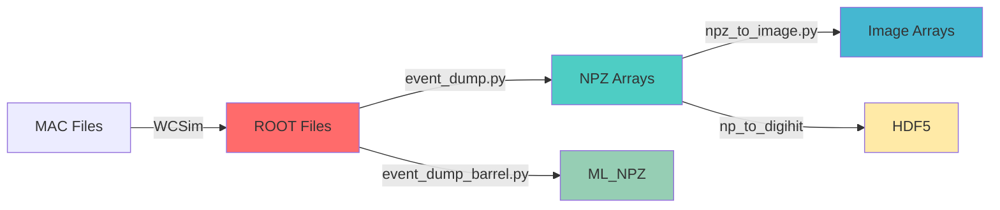
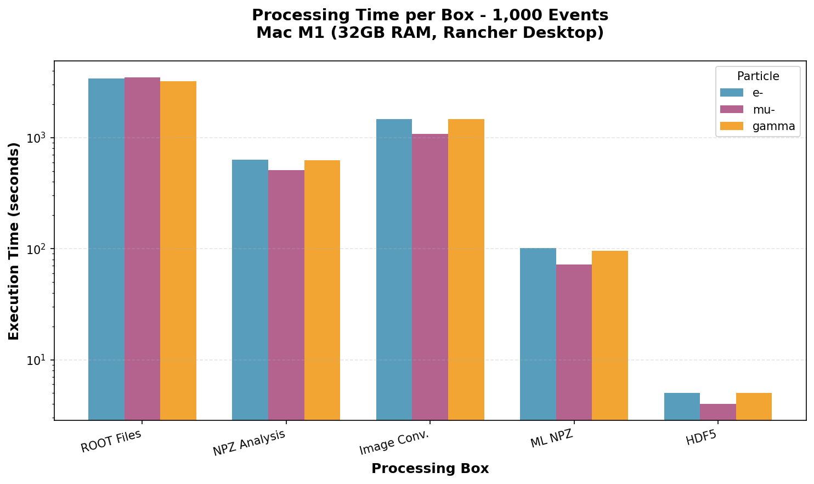
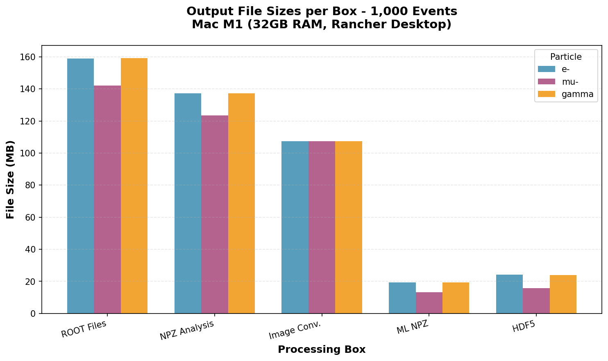
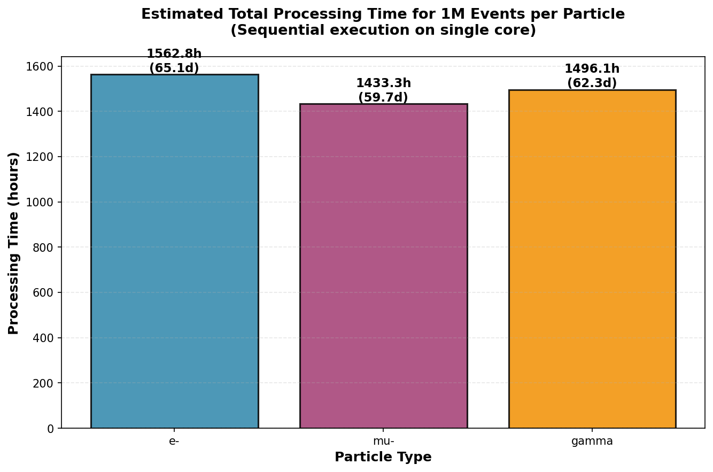
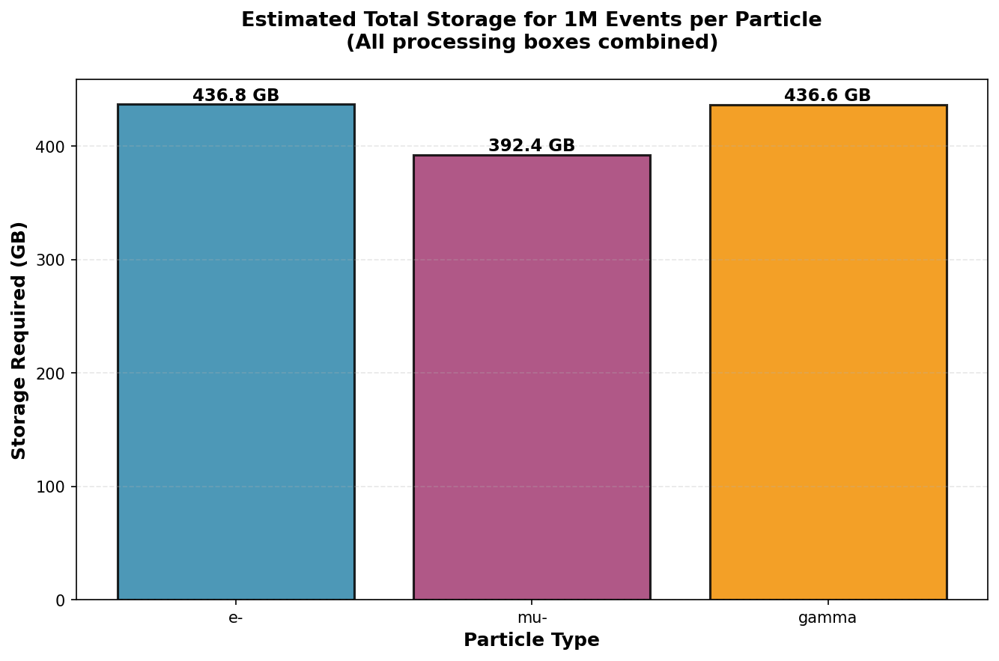

# 🚀 WCSim Performance Benchmark Report

<div align="center">


**Análisis Cuantitativo de Recursos Computacionales**  
*Pipeline de Procesamiento de Eventos de Física de Partículas*

---

**Autor:** Carlos Guzmán | **Institución:** Maestría en Ciencias Aplicadas  
**Curso:** Tópicos de Industria | **Fecha:** Abril 2026

[📊 Ver Resultados](#resultados-clave) • [📈 Proyecciones](#proyecciones-1m-eventos) • [💾 Datos](#datos-experimentales) • [🔧 Metodología](#metodologia-experimental)

</div>

---

## 🎯 Resultados Clave

<table>
<tr>
<td width="50%">

### ⏱️ Tiempo de Procesamiento
```
Total (3 partículas × 1K eventos):
├─ 269.52 minutos (4.49 horas)
├─ Caja 4 (ROOT): 60-68% del tiempo
└─ Proyección 1M eventos: 187 días
```

</td>
<td width="50%">

### 💾 Almacenamiento
```
Total (3 partículas × 1K eventos):
├─ 1,296 MB (~1.27 GB)
├─ ROOT + NPZ: 66% del espacio
└─ Proyección 1M eventos: 1.23 TB
```

</td>
</tr>
</table>

### 🏆 Métricas de Rendimiento por Partícula

| Partícula | ⏱️ Tiempo (min) | 💾 Espacio (MB) | 🎯 Eficiencia |
|:---------:|:---------------:|:---------------:|:-------------:|
| **e⁻** (Electrón) | 93.76 | 447.3 | ⭐⭐⭐ |
| **μ⁻** (Muon) | 86.00 | 401.8 | ⭐⭐⭐⭐ |
| **γ** (Gamma) | 89.76 | 447.1 | ⭐⭐⭐ |

> 💡 **Insight:** Los muones son ~8% más eficientes debido a menor producción de cascadas electromagnéticas

---

## 🖥️ Configuración del Sistema

<details>
<summary><b>🔧 Hardware Specifications</b> (Click para expandir)</summary>

| Componente | Especificación | Notas |
|------------|----------------|-------|
| **Procesador** | Apple M1 (8-core) | 4P + 4E cores |
| **Memoria** | 32 GB LPDDR4X | Unified Memory |
| **Almacenamiento** | 512 GB NVMe SSD | ~450 GB disponibles |
| **Arquitectura** | ARM64 (Apple Silicon) | Emulación x86_64 |

</details>

<details>
<summary><b>🐳 Software Stack</b> (Click para expandir)</summary>

```yaml
Sistema Operativo: macOS Sonoma 14.4.1
Containerización:
  - Runtime: Rancher Desktop 1.13.1
  - Engine: Docker 26.0.0
  - Emulación: Rosetta 2 (amd64 → arm64)
Simulación:
  - Imagen: manu33/wcsim:1.2
  - Base: linux/amd64
  - Framework: Geant4 + ROOT
```

</details>

<details>
<summary><b>⚙️ Configuración de Recursos</b> (Click para expandir)</summary>

| Configuración | CPUs | RAM | Uso |
|---------------|:----:|:---:|-----|
| **Inicial** | 2 | 6 GB | Pruebas preliminares |
| **Optimizada** ✅ | 6 | 18 GB | Mediciones finales |

> ⚠️ **Overhead de emulación:** ~20-30% vs. ejecución nativa x86_64

</details>

---

## 🔬 Metodología Experimental

### Pipeline de Procesamiento



### 📦 Cajas de Procesamiento

| # | Nombre | Input → Output | Herramienta | Criticidad |
|:-:|--------|----------------|-------------|:----------:|
| **4** | ROOT Generation | MAC → ROOT | WCSim | 🔴 Alta |
| **5** | NPZ Conversion | ROOT → NPZ | event_dump.py | 🟡 Media |
| **6** | Image Arrays | NPZ → IMG | npz_to_image.py | 🟡 Media |
| **8** | ML Optimization | ROOT → ML_NPZ | event_dump_barrel.py | 🟢 Baja |
| **9** | HDF5 Export | NPZ → H5 | np_to_digihit | 🟢 Baja |

### 🎲 Parámetros de Simulación

<table>
<tr>
<td>

**Partículas Evaluadas:**
- e⁻ (Electrón) @ 500 MeV
- μ⁻ (Muon) @ 500 MeV  
- γ (Gamma) @ 500 MeV

</td>
<td>

**Configuración Geant4:**
```bash
/gun/energy 500 MeV
/gun/direction 1 0 0
/gun/position 0 0 0
/run/beamOn 1000
```

</td>
</tr>
</table>

📁 **Archivos MAC:** [`./mac/`](./mac/)

---

## 📊 Datos Experimentales

### Mediciones Completas (1,000 eventos)

<details open>
<summary><b>📋 Tabla de Resultados Detallados</b></summary>

| Partícula | Caja | ⏱️ Tiempo (s) | ⏱️ Tiempo (min) | 💾 Bytes | 💾 MB |
|:---------:|:----:|-------------:|---------------:|---------:|------:|
| **e⁻** | 4_ROOT | 3,417 | 56.95 | 166,723,584 | 159.0 |
| **e⁻** | 5_NPZ | 630 | 10.50 | 143,945,380 | 137.3 |
| **e⁻** | 6_IMG | 1,473 | 24.55 | 112,640,128 | 107.4 |
| **e⁻** | 8_MLNPZ | 101 | 1.68 | 20,359,864 | 19.4 |
| **e⁻** | 9_H5 | 5 | 0.08 | 25,381,204 | 24.2 |
| **μ⁻** | 4_ROOT | 3,493 | 58.22 | 148,897,792 | 142.0 |
| **μ⁻** | 5_NPZ | 509 | 8.48 | 129,400,435 | 123.4 |
| **μ⁻** | 6_IMG | 1,082 | 18.03 | 112,640,128 | 107.4 |
| **μ⁻** | 8_MLNPZ | 72 | 1.20 | 13,998,397 | 13.3 |
| **μ⁻** | 9_H5 | 4 | 0.07 | 16,432,360 | 15.7 |
| **γ** | 4_ROOT | 3,200 | 53.33 | 166,873,526 | 159.1 |
| **γ** | 5_NPZ | 627 | 10.45 | 143,824,572 | 137.2 |
| **γ** | 6_IMG | 1,458 | 24.30 | 112,640,128 | 107.4 |
| **γ** | 8_MLNPZ | 96 | 1.60 | 20,205,852 | 19.3 |
| **γ** | 9_H5 | 5 | 0.08 | 25,234,448 | 24.1 |

</details>

### 📈 Visualizaciones

<table>
<tr>
<td width="50%">

#### ⏱️ Tiempos de Procesamiento

*Escala logarítmica - Caja 4 domina el tiempo total*

</td>
<td width="50%">

#### 💾 Tamaños de Archivo

*ROOT y NPZ representan 66% del almacenamiento*

</td>
</tr>
</table>

---

## 🚀 Proyecciones 1M Eventos

### Escalamiento Lineal (×1,000)

<div align="center">

| Métrica | Valor | Equivalente |
|:--------|------:|:------------|
| **⏱️ Tiempo Total** | 4,492 horas | 187.2 días |
| **💾 Almacenamiento** | 1.23 TB | 1,266 GB |
| **🔄 Paralelización (100 cores)** | 44.9 horas | 1.9 días |

</div>

### 📊 Proyecciones por Partícula

<table>
<tr>
<td width="50%">

#### ⏱️ Tiempo Estimado


</td>
<td width="50%">

#### 💾 Almacenamiento Estimado


</td>
</tr>
</table>

### 🔍 Desglose Detallado por Caja

<details>
<summary><b>Ver tabla completa de proyecciones</b></summary>

| Partícula | Caja | ⏱️ Tiempo (h) | % Tiempo | 💾 Tamaño (GB) | % Espacio |
|:---------:|:----:|-------------:|---------:|---------------:|----------:|
| e⁻ | 4_ROOT | 949.2 | 60.7% | 155.6 | 35.6% |
| e⁻ | 5_NPZ | 175.0 | 11.2% | 134.1 | 30.7% |
| e⁻ | 6_IMG | 409.2 | 26.2% | 104.9 | 24.0% |
| e⁻ | 8_MLNPZ | 28.1 | 1.8% | 19.0 | 4.3% |
| e⁻ | 9_H5 | 1.4 | 0.1% | 23.6 | 5.4% |
| μ⁻ | 4_ROOT | 970.3 | 67.7% | 136.8 | 34.9% |
| μ⁻ | 5_NPZ | 141.4 | 9.9% | 120.5 | 30.7% |
| μ⁻ | 6_IMG | 300.6 | 21.0% | 104.9 | 26.7% |
| μ⁻ | 8_MLNPZ | 20.0 | 1.4% | 13.0 | 3.3% |
| μ⁻ | 9_H5 | 1.1 | 0.1% | 15.3 | 3.9% |
| γ | 4_ROOT | 888.9 | 59.4% | 155.4 | 35.6% |
| γ | 5_NPZ | 174.2 | 11.6% | 134.0 | 30.7% |
| γ | 6_IMG | 405.0 | 27.1% | 104.9 | 24.0% |
| γ | 8_MLNPZ | 26.7 | 1.8% | 18.8 | 4.3% |
| γ | 9_H5 | 1.4 | 0.1% | 23.5 | 5.4% |

</details>

---

## 💡 Conclusiones y Recomendaciones

### 🎯 Hallazgos Principales

<table>
<tr>
<td width="50%">

#### 🔴 Cuellos de Botella

1. **Caja 4 (ROOT Generation)**
   - 60-68% del tiempo total
   - Candidato #1 para optimización
   - Ideal para paralelización masiva

2. **Almacenamiento ROOT + NPZ**
   - 66% del espacio total
   - Considerar compresión agresiva

</td>
<td width="50%">

#### 🟢 Oportunidades

1. **Cajas Ligeras (8 y 9)**
   - < 2% del tiempo combinado
   - No requieren optimización

2. **Variabilidad de Partículas**
   - Muones: 8% más eficientes
   - Física de interacción diferente

</td>
</tr>
</table>

### 📋 Recomendaciones Estratégicas

| Escenario | Configuración | Tiempo | Viabilidad |
|-----------|---------------|--------|:----------:|
| **Secuencial (1 core)** | Mac M1 | 187 días | ❌ Inviable |
| **Paralelo (10 cores)** | Cluster pequeño | 18.7 días | ⚠️ Limitado |
| **Paralelo (100 cores)** | HPC Cluster | 1.9 días | ✅ Viable |
| **Paralelo (1000 cores)** | Cloud/Supercomputer | 4.5 horas | ✅ Óptimo |

### 🏗️ Arquitectura Recomendada

```
Desarrollo/Pruebas:
└─ Apple Silicon M1 (actual)
   ├─ Ventajas: Eficiencia energética, memoria unificada
   └─ Limitaciones: Overhead emulación 20-30%

Producción:
└─ Cluster x86_64 nativo
   ├─ 100-1000 cores
   ├─ 2-4 TB almacenamiento
   └─ Red de alta velocidad (10+ Gbps)
```

### 💾 Planificación de Almacenamiento

| Dataset | Tamaño Base | Margen 20% | Total Recomendado |
|---------|------------:|-----------:|------------------:|
| 3 partículas × 1M eventos | 1.23 TB | +246 GB | **2.0 TB** |

> 💡 Incluye espacio para archivos temporales, respaldos y margen de seguridad

---

## 📚 Recursos Adicionales

<details>
<summary><b>🔧 Comandos de Ejecución</b></summary>

### Generación ROOT (Caja 4)
```bash
docker exec WCSim bash -c "cd /home/neutrino/software; source run.sh; \
  cd \$SOFTWARE/WCSim_build; \
  ./WCSim /home/neutrino/data/1_MAC/VaryE/e-/wcs_MCA_e-__0_500_MeV.mac; \
  mv wcs_MCA_e-__0_500_MeV.root /home/neutrino/data/2_ROOT/VaryE/e-/"
```

### Conversión NPZ (Caja 5)
```bash
docker exec WCSim bash -c "cd /home/neutrino/software; source run.sh; \
  cd /home/WatChMal/DataTools/DataTools-master/root_utils; \
  export PYTHONPATH=/home/WatChMal/DataTools/DataTools-master:\$PYTHONPATH; \
  python3 event_dump.py \
    /home/neutrino/data/2_ROOT/VaryE/e-/wcs_MCA_e-__0_500_MeV.root \
    -d /home/neutrino/data/3_Analisis_NPZ/VaryE/e-"
```

</details>

<details>
<summary><b>📊 Generación de Gráficas</b></summary>

```bash
cd tarea5_cagm/scripts
python3 make_charts_cagm.py
```

Las gráficas se generan automáticamente en `tarea5_cagm/figures/`.

</details>

<details>
<summary><b>📁 Estructura del Proyecto</b></summary>

```
tarea5_cagm/
├── README_Tarea5_CAGM.md          # Este documento
├── mac/                            # Configuraciones Geant4
│   ├── wcs_MCA_e-__0_500_MeV.mac
│   ├── wcs_MCA_mu-__0_500_MeV.mac
│   └── wcs_MCA_gamma__0_500_MeV.mac
├── output/
│   └── results_cagm.csv           # Datos experimentales
├── figures/                        # Visualizaciones
│   ├── tiempos_1k_cagm.png
│   ├── tamanos_1k_cagm.png
│   ├── estimado_horas_1M_cagm.png
│   └── estimado_gb_1M_cagm.png
└── scripts/
    ├── bench_cagm.sh              # Script de medición
    └── make_charts_cagm.py        # Generador de gráficas
```

</details>

### 🔗 Referencias

- [WCSim GitHub](https://github.com/WCSim/WCSim) - Water Cherenkov Simulator
- [DataTools](https://github.com/WatChMaL/DataTools) - WatChMaL Processing Tools
- [Docker Hub](https://hub.docker.com/r/manu33/wcsim) - Imagen manu33/wcsim:1.2

---

<div align="center">

### 👤 Información de Contacto

**Carlos Guzmán**  
Maestría en Ciencias Aplicadas | Tópicos de Industria  
Abril 2026

---

*Documento generado como parte del análisis de capacidades computacionales*  
*para simulaciones de física de partículas utilizando WCSim en Apple Silicon*

[](https://www.markdownguide.org/)
[](https://www.apple.com/macos/)
[](https://hub.docker.com/r/manu33/wcsim)

</div>
