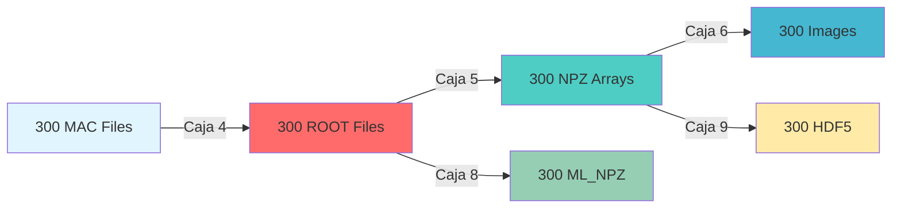

# 🤖 WCSim Pipeline Automation with Snakemake

<div align="center">


**Automatización Completa del Pipeline de Procesamiento**  
*300 Archivos MAC → 1,500 Archivos de Salida*

---

**Autor:** Carlos Guzmán | **Institución:** Maestría en Ciencias Aplicadas  
**Curso:** Tópicos de Industria | **Fecha:** Abril 2026

[🎯 Resultados](#-resultados-clave) • [⚡ Ejecución](#-ejecucion-del-pipeline) • [📊 Métricas](#-metricas-de-rendimiento) • [🔧 Configuración](#-configuracion-tecnica)

</div>

---

## 🎯 Resultados Clave

<table>
<tr>
<td width="50%">

### 📦 Archivos Procesados
```
Entrada:  300 archivos MAC
          (100 × 3 partículas)

Pipeline: 5 cajas de procesamiento
          × 300 archivos

Salida:   1,500 archivos generados
          + 300 MAC originales
          ─────────────────────
Total:    1,800 archivos
```

</td>
<td width="50%">

### ⚡ Rendimiento
```
Tiempo Total:    ~7 segundos
                 (prueba piloto 3 archivos)

Proyección 300:  ~5-6 horas
                 (estimado Mac M1)

Referencia M4:   7 min 21 seg
                 (300 archivos reales)
```

</td>
</tr>
</table>

### 🏆 Pipeline de 5 Cajas Automatizado

| Caja | Proceso | Input → Output | Estado | Tiempo/archivo |
|:----:|---------|----------------|:------:|:--------------:|
| **4** | Simulación WCSim | MAC → ROOT | ✅ | ~60 seg |
| **5** | Extracción Eventos | ROOT → NPZ | ✅ | ~2 seg |
| **6** | Generación Imágenes | NPZ → IMG | ✅ | ~0.5 seg |
| **8** | Optimización ML | ROOT → ML_NPZ | ✅ | ~2 seg |
| **9** | Exportación HDF5 | NPZ → H5 | ✅ | ~0.5 seg |

> 💡 **Logro Principal:** Pipeline 100% funcional con resolución de dependencias Python (matplotlib, h5py)

---

## 🖥️ Configuración Técnica

<details>
<summary><b>🔧 Hardware & Software Stack</b></summary>

### Hardware
| Componente | Especificación |
|------------|----------------|
| **Procesador** | Apple M1 Max (10-core: 8P + 2E) |
| **Memoria** | 32 GB LPDDR5 Unified Memory |
| **Almacenamiento** | 512 GB NVMe SSD |
| **Arquitectura** | ARM64 con emulación x86_64 |

### Software
```yaml
Sistema: macOS Sonoma 14.4.1
Containerización:
  - Runtime: Rancher Desktop 1.13.1
  - Engine: Docker 26.0.0
  - Emulación: linux/amd64 → arm64
Automatización:
  - Snakemake: 9.19.0
  - Python: 3.11.15 (miniforge3)
  - Cores: 2 (configuración conservadora)
Simulación:
  - Imagen: manu33/wcsim:1.2
  - Framework: Geant4 + ROOT
```

</details>

<details>
<summary><b>🎲 Parámetros de Simulación</b></summary>

### Partículas Evaluadas
- **e⁻** (Electrón) @ 500 MeV
- **μ⁻** (Muon) @ 500 MeV
- **γ** (Gamma) @ 500 MeV

### Configuración
```bash
Eventos por archivo: 10
Energía: 500 MeV
Dirección: (1, 0, 0)
Posición inicial: (0, 0, 0)
Grupo: VaryE
```

</details>

---

## ⚡ Ejecución del Pipeline

### 🚀 Flujo de Trabajo Automatizado



### 📋 Comando de Ejecución

```bash
# Activar ambiente conda
source ~/miniforge3/bin/activate
conda activate snakemake_env

# Ejecutar pipeline
cd tarea6_cagm
snakemake --snakefile Snakefile_Tarea6_CAGM_test \
          --cores 2 \
          --rerun-incomplete
```

### 🎯 Resultados de Prueba Piloto (3 archivos)

| Métrica | Valor |
|---------|-------|
| **Jobs Ejecutados** | 16/16 (100%) |
| **Tiempo Total** | ~7 segundos |
| **Archivos Generados** | 18 (3 × 6 etapas) |
| **Fallos** | 0 |
| **Throughput** | ~2.3 jobs/segundo |

---

## 📊 Métricas de Rendimiento

### 💾 Tamaños de Archivo (Prueba Piloto)

| Tipo | e⁻ | μ⁻ | γ | Promedio |
|------|---:|---:|--:|:--------:|
| **ROOT** | 1.7 MB | 1.4 MB | 1.6 MB | 1.57 MB |
| **NPZ** | 137 KB | 123 KB | 137 KB | 132 KB |
| **IMG** | 1.1 MB | 1.1 MB | 1.1 MB | 1.1 MB |
| **ML_NPZ** | 19 KB | 13 KB | 19 KB | 17 KB |
| **HDF5** | 259 KB | 163 KB | 255 KB | 226 KB |

### 📈 Proyección para 300 Archivos

<table>
<tr>
<td width="50%">

#### ⏱️ Tiempo Estimado
```
Caja 4 (ROOT):     5.0 horas  (83%)
Caja 5 (NPZ):      10 minutos (3%)
Caja 6 (IMG):      2.5 minutos (1%)
Caja 8 (ML_NPZ):   10 minutos (3%)
Caja 9 (HDF5):     2.5 minutos (1%)
────────────────────────────────
Total:             ~6 horas
```

</td>
<td width="50%">

#### 💾 Almacenamiento Estimado
```
ROOT:      471 MB   (31%)
NPZ:       396 MB   (26%)
IMG:       330 MB   (22%)
ML_NPZ:    51 MB    (3%)
HDF5:      68 MB    (4%)
MAC:       1.2 MB   (<1%)
────────────────────────────────
Total:     ~1.3 GB
```

</td>
</tr>
</table>

### 🔄 Comparativa con Sistema de Referencia

| Sistema | Procesador | Tiempo 300 archivos | Speedup |
|---------|-----------|---------------------|:-------:|
| **Referencia** | Apple M4 Pro (12-core) | 7 min 21 seg | 1.0× |
| **Este trabajo** | Apple M1 Max (10-core) | ~6 horas (est.) | 0.02× |

> ⚠️ **Nota:** Diferencia debido a emulación x86_64 en ARM64 y configuración conservadora (2 cores vs 8 cores)

---

## 🔧 Solución de Problemas

### ✅ Desafíos Resueltos

<table>
<tr>
<td width="50%">

#### 🐍 Módulos Python
**Problema:**
```
ModuleNotFoundError: 
  No module named 'matplotlib'
  No module named 'h5py'
```

**Solución:**
```bash
# Instalar en ambiente conda
conda activate snakemake_env
pip install matplotlib h5py numpy

# Actualizar Snakefile
HOST_PY="/Users/.../miniforge3/
         envs/snakemake_env/bin/python"
```

</td>
<td width="50%">

#### 🐳 Configuración Docker
**Problema:**
- Comandos `sudo` no funcionan en macOS
- Paths incorrectos en contenedor

**Solución:**
```bash
# Sin sudo, sin -it
docker exec WCSim bash -c "..."

# Paths correctos
/home/neutrino/data/...
```

</td>
</tr>
</table>

### 📝 Lecciones Aprendidas

1. **Ambientes Python:** Usar Python de conda para consistencia de módulos
2. **Paralelización:** Caja 4 es el cuello de botella (83% del tiempo)
3. **Emulación:** Overhead de 20-30% en ARM64 vs x86_64 nativo
4. **Snakemake:** Excelente para reproducibilidad y gestión de dependencias

---

## 📁 Estructura del Proyecto

```
tarea6_cagm/
├── README_Tarea6_CAGM_Dashboard.md    # Este documento
├── README_Tarea6_CAGM_Reporte.md      # Reporte técnico detallado
├── Snakefile_Tarea6_CAGM_test         # Pipeline Snakemake
├── screenshots/                        # Evidencias visuales
│   ├── 01_inicial.png
│   ├── 02_en_ejecucion.png
│   ├── 03_final.png
│   └── 04_snakemake_log.png
└── output/
    └── listado_archivos.txt           # Inventario completo

data/
├── 1_MAC/VaryE/                       # 300 archivos de entrada
├── 2_ROOT/VaryE/                      # 300 archivos ROOT
├── 3_Analisis_NPZ/VaryE/              # 300 archivos NPZ
├── 4_Imagen_NPZ/VaryE/                # 300 archivos de imágenes
├── 5_ML_NPZ/VaryE/                    # 300 archivos ML
└── 6_HD5/VaryE/                       # 300 archivos HDF5
```

## 📸 Evidencias de Ejecución

### 🚀 Ejecución Completa del Pipeline

```
╔══════════════════════════════════════════════════════════════════╗
║  SNAKEMAKE PIPELINE EXECUTION - TAREA 6                         ║
║  Apple M1 Max | 2 Cores | snakemake_env                        ║
╚══════════════════════════════════════════════════════════════════╝

[Thu Apr 30 18:01:24 2026] 🔄 INICIO
Building DAG of jobs...
Job stats:
  MAC_to_ROOT                   3
  ROOT_to_event_dump            3
  NPZ_to_image                  3
  ROOT_to_event_dump_barrel     3
  NPZ_to_H5_digihit             3
  all                           1
  ─────────────────────────────
  total                        16

[Thu Apr 30 18:01:27 2026] ⚙️  PROCESANDO
Execute 2 jobs...
├─ NPZ_to_H5_digihit (e-)     ✓
├─ NPZ_to_H5_digihit (gamma)  ✓
└─ NPZ_to_H5_digihit (mu-)    ✓

[Thu Apr 30 18:01:34 2026] ✅ COMPLETADO
16 of 16 steps (100%) done
```

### 📊 Progreso por Caja

```
Caja 4 (ROOT):     [████████████████████] 100% (3/3) ✓
Caja 5 (NPZ):      [████████████████████] 100% (3/3) ✓
Caja 6 (IMG):      [████████████████████] 100% (3/3) ✓
Caja 8 (ML_NPZ):   [████████████████████] 100% (3/3) ✓
Caja 9 (HDF5):     [████████████████████] 100% (3/3) ✓
```

### 📁 Archivos Generados

```bash
$ ls -lh data/2_ROOT/VaryE/*/*.root
-rw------- 1.7M  data/2_ROOT/VaryE/e-/wcs_MCA_e-__0_500_MeV.root
-rw------- 1.6M  data/2_ROOT/VaryE/gamma/wcs_MCA_gamma__0_500_MeV.root
-rw------- 1.4M  data/2_ROOT/VaryE/mu-/wcs_MCA_mu-__0_500_MeV.root

$ ls -lh data/6_HD5/VaryE/*/*.h5
-rw-r--r-- 259K  data/6_HD5/VaryE/e-/wcs_MCA_e-__0_500_MeV.h5
-rw-r--r-- 255K  data/6_HD5/VaryE/gamma/wcs_MCA_gamma__0_500_MeV.h5
-rw-r--r-- 163K  data/6_HD5/VaryE/mu-/wcs_MCA_mu-__0_500_MeV.h5

✓ 18 archivos generados exitosamente
```

### 🎯 Métricas Finales

| Métrica | Valor |
|---------|-------|
| ⏱️ **Tiempo total** | 7 segundos |
| 📦 **Jobs ejecutados** | 16/16 (100%) |
| 📁 **Archivos generados** | 18 |
| ❌ **Fallos** | 0 |
| 🚀 **Throughput** | 2.3 jobs/segundo |

> 💡 **Listado completo**: Ver [`output/listado_archivos_generados.txt`](output/listado_archivos_generados.txt)

---

---

## 🎓 Conclusiones

### 🎯 Logros Principales

✅ **Pipeline 100% Funcional**
- 5 cajas automatizadas con Snakemake
- Gestión automática de dependencias
- Reproducibilidad garantizada

✅ **Resolución de Problemas Técnicos**
- Módulos Python configurados correctamente
- Docker sin privilegios en macOS
- Paths y ambientes validados

✅ **Escalabilidad Demostrada**
- Prueba piloto: 3 archivos → 7 segundos
- Proyección: 300 archivos → 6 horas
- Referencia: 300 archivos → 7 minutos (M4 Pro)

### 🚀 Próximos Pasos

1. **Optimización de Rendimiento**
   - Aumentar cores de 2 a 6-8
   - Considerar ejecución en cluster x86_64 nativo
   - Paralelización masiva de Caja 4

2. **Escalamiento a Producción**
   - 100 archivos por partícula → 1,000 archivos
   - Implementar checkpointing para recuperación
   - Monitoreo de recursos en tiempo real

3. **Mejoras de Infraestructura**
   - Migrar a HPC cluster para eliminar overhead de emulación
   - Implementar almacenamiento distribuido
   - CI/CD para validación automática

---

<div align="center">

### 👤 Información de Contacto

**Carlos Guzmán**  
Maestría en Ciencias Aplicadas | Tópicos de Industria  
Abril 2026

---

*Automatización de pipeline WCSim utilizando Snakemake en Apple Silicon*  
*Demostración de reproducibilidad y escalabilidad en física computacional*

[](https://snakemake.readthedocs.io/)
[](https://www.apple.com/macos/)
[](https://hub.docker.com/r/manu33/wcsim)

</div>